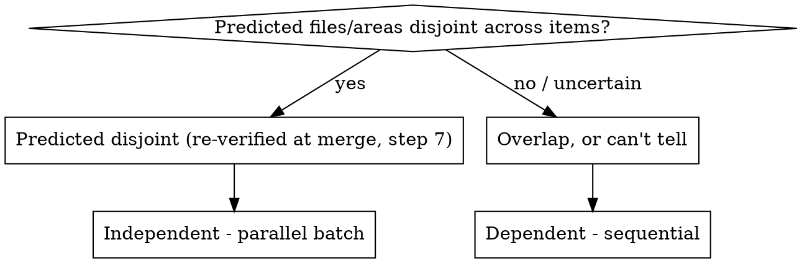

# Decomposing Compound Requests

## Overview

A bundled request tempts you to work through it serially in one continuous context — each item alone looks "too small to bother delegating." That instinct is the failure mode: shared context lets one item's exploration dilute another's reasoning, and a shared working tree lets one item's staged changes bleed into another's commit (e.g. `git mv` auto-staging a rename that then rides along into an unrelated fix's commit).

**Core principle:** one isolated subagent per item; only its final summary re-enters your context. All human input happens once, at the upfront checkpoint gate — the run is unattended *after* the answers, never instead of them.

**Announce at start:** "I'm using decomposing-compound-requests to split and isolate this request."

## When to Use

- The request lists 2+ separately shippable changes joined by "and"/"also", a numbered or bulleted list, or bug reports bundled with feature asks.
- Not for one feature described in parts ("add a login form: validation, tests, wire up the API") — that's one item with subtasks.
- Tiebreaker: would each part land as its own commit/PR whose message doesn't need to mention the others? If yes — or if unsure — treat it as compound; scoping is cheap, cross-contamination isn't.

## Process

1. **Enumerate items.** List each distinct ask verbatim, in the user's own terms, numbered.
2. **Scope each item** — always in parallel, always read-only (e.g. Explore agents). Each reports: expected files/areas to touch, and any open question that would block unattended implementation (see "Good checkpoint questions" below — surface ambiguity here, not after dispatch). Scopers must explicitly check shared touchpoints predictions routinely miss: lockfiles, generated files, barrel/route/config registries.
3. **Form work items, then build the dependency graph.** A work item is usually one ask. But first run every overlapping or adjacent pair of asks through the shippability tiebreaker as a *grouping* test: if one ask cannot land as its own coherent commit without the other — a rename and its caller updates, a prerequisite with no standalone value, the same mechanical edit repeated across locations — merge them into ONE work item, so no merge ever leaves the tree broken between them. Be critical in both directions: sharing a file, being "related", or saving a dispatch is NOT grounds for grouping — separately shippable asks stay separate work items (sequential if they overlap). Every multi-ask work item carries a one-line justification, shown at the checkpoint for the human to override. Then build the dependency graph over work items (decision tree below). Every dependent edge gets a direction: the user's stated order wins; else prerequisite-first; else it's a checkpoint question.
4. **Checkpoint — this is a GATE, not a status update.** Present in one message: the work items (with the ask→item mapping and each group's justification), the graph as batches, and every open question batched together (including, when items will land independently: one integration branch/PR, or one per item?). Then **STOP: dispatch no implementer until your human partner has answered** — the resolutions baked into each brief are theirs, not yours. A decision the request already delegated ("if you think it's appropriate") is not a question: state your decision at the checkpoint alongside the questions, so they can override it in the same round-trip. Zero open questions → present the list and graph, state you're proceeding, and continue without waiting. The checkpoint is a dialogue, not a one-shot form: the human may question any item before deciding, and the gate stays closed across the whole exchange until every open question is genuinely answered — a question back is not an answer, and never self-resolve the rest to get moving.
5. **Prepare.** Create an umbrella integration branch in an isolated workspace (superpowers:using-git-worktrees — never implement on main). Write each item's dispatch brief to a file: the item text verbatim, its expected-file list, and the resolved answers. The brief set is the plan that superpowers:subagent-driven-development executes.
6. **Dispatch** per the Quick Reference, batches in topological order. Complete a batch's reviews and merges before dispatching the next batch — never run sequential items while parallel branches from an earlier batch sit unmerged (their merge bases shift and manufacture conflicts).
7. **Review, verify, merge — per branch, before its merge.** Every branch gets a task review (spec compliance + code quality, per superpowers:subagent-driven-development's task-reviewer contract). Then compare the branch's actual diff (`git diff --stat <base>..<branch>`) against its predicted file set: unexpected overlap with another item's actual or predicted files means the independence premise is dead — merge one, then re-verify (or re-dispatch) the other on top of the merged result. Run the test suite (or, if none exists, the verification method declared at the checkpoint) after each merge, not only at the end. Update the checkpoint file's per-item status at dispatch and at merge, and record each review verdict there at review time — a verdict living only in conversation doesn't survive compaction.
8. **Report and hand off** to superpowers:finishing-a-development-branch — on the umbrella branch, or per item branch if the user chose per-item PRs at the checkpoint. The checkpoint's integration answer already IS that skill's options menu, answered — execute it without re-asking.

### Good checkpoint questions

The whole run rides on the questions being right the first time — a gap found mid-run breaks the unattended promise. State each one well:

- **Lead with a recommended default, then the real alternatives** — never a bare "what do you want?". Prefer a few concrete options the human can pick from.
- **Run every requirement through the two-readings test.** If a phrase could be built two ways that produce different output — "capitalize the first letter" → leave the rest, or title-case the whole? — that divergence IS a question. Surface the readings side by side; do not silently pick one. This is the failure a weaker model makes most: it waves an ambiguous ask through as "standalone" instead of asking.
- **Include the edge cases the change introduces** — empty/null input, and any existing behavior the change would alter.
- **Anticipate second-order questions.** If one answer forces another ("if `greet` now capitalizes, should `farewell` match?"), ask both now, not after the first is answered.

### Independence decision (step 3)

A scoping pass that didn't rule out overlap is not evidence of independence — it's an incomplete answer. Default to dependent whenever in doubt.

## Quick Reference

| Batch type | Mechanism |
|---|---|
| Scoping (any item) | Always parallel, read-only, regardless of the items' own dependencies |
| Parallel (predicted independent) | Dispatch each implementer in the same message with `isolation: "worktree"`. If the target repo is not the session's repo, native worktree isolation isolates the wrong repo — create `git worktree`s inside the target repo instead (superpowers:using-git-worktrees' fallback). Note: superpowers:subagent-driven-development's "never dispatch implementers in parallel" red flag is a shared-working-tree constraint — worktree isolation is what lifts it. Its task-review requirement is NOT lifted (step 7). |
| Sequential (dependent, or uncertain) | One implementer at a time on the umbrella branch, per superpowers:subagent-driven-development. After each item's commit, check `git show --stat` against its expected files — this catches an auto-staged file riding along into the wrong commit. |
| Any implementer | Its brief carries its expected-file list; it reports any file touched outside it. Free to invoke skills its own task needs (test-driven-development, systematic-debugging) inside its own context. Design ambiguity the brief doesn't answer → report NEEDS_CONTEXT; never decide alone. |

## Failure Protocol

A BLOCKED, failed, or merge-conflicting item never aborts its siblings: skip that item's merge, preserve its branch, continue merging the rest, and lead the consolidated report with the stranded item and what it needs. Never auto-resolve a non-trivial conflict mid-run.

## Consolidated Report

Per item: status (DONE / DONE_WITH_CONCERNS / NEEDS_CONTEXT / BLOCKED, per superpowers:subagent-driven-development's contract), branch and commits, tests run with results, deviations from the brief, unresolved concerns. Plus an integration section: merge order, each conflict and its resolution, final combined verification result.

**Durable state:** the checkpoint file is the run's ledger. After compaction or resume, trust it and `git log` over recollection — never re-dispatch an item it marks merged.

## Common Mistakes

| Rationalization | Reality |
|---|---|
| "Each item is small/fully specified, delegating adds overhead" | The point isn't per-item overhead — it's stopping one item's exploration or staged changes from bleeding into another's. Isolate regardless of size. |
| "These seem unrelated enough to parallelize" | Absence of evidence of overlap ≠ evidence of independence. No disjoint-files prediction from scoping → sequential. |
| Answering your own checkpoint questions "to keep the run unattended" | The unattended part starts after the human's answers, not instead of them. Present, then stop. |
| "This is really one refactoring effort described in parts" | Apply the tiebreaker: separate commits/PRs whose messages don't mention each other → compound. Unsure → compound. |
| Merging a branch without its task review | Unattended + unreviewed is the worst combination. Review before every merge, parallel or sequential. |
| "Both asks touch the same file — one implementer can do both" | Same file ≠ same shippable unit. Group only when neither ask lands coherently alone; otherwise they're separate sequential items. |
| Keeping a change and its required caller updates as two work items | Two commits where the first breaks the tree and the second repairs it is one change split wrong. The tiebreaker cuts both ways — merge them. |

## Integration

**Required:** superpowers:subagent-driven-development (implementer/reviewer contracts, sequential mechanics), superpowers:using-git-worktrees (umbrella branch + isolation mechanics), superpowers:finishing-a-development-branch (final integration).
**Related:** superpowers:dispatching-parallel-agents — governs read-only *investigation* bundles (its shared-tree parallel dispatch is fine when nothing is committed). The moment bundled items change code, this skill supersedes it: shared-tree parallel implementation is exactly the staging-bleed hazard this skill exists to remove.
